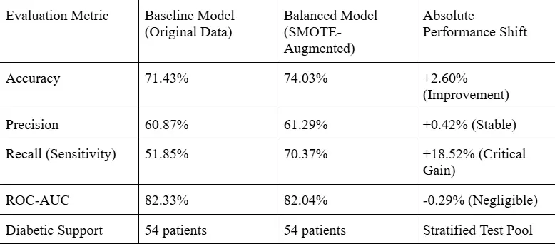

# Diabetes Classifier: Balancing Medical Datasets with SMOTE for Diagnostic Screening

An end-to-end, machine learning pipeline designed to predict diabetic patient risk from clinical health metrics. This project addresses the challenge of **severe class imbalances** in clinical datasets, demonstrating how synthetic oversampling techniques (**SMOTE**) can optimize diagnostic performance and support high-stakes clinical decision-making.

---

## Project Overview
In medical diagnostic screening, class imbalance is a frequent and critical bottleneck. In this dataset of 768 patients, only **268 are diagnosed with diabetes (positive class)** while **500 are healthy (negative class)**. 

A standard classifier trained on this data would bias toward the majority class (healthy patients), leading to high overall accuracy but a dangerously low **Recall (Sensitivity)**. For clinical diagnostics, **missing a high-risk patient (False Negative) is significantly more dangerous than a false alarm (False Positive)**.

This pipeline scales clinical features, applies **SMOTE (Synthetic Minority Over-sampling Technique)** to balance training distributions, trains multiple Logistic Regression models, and evaluates their trade-offs under a strict clinical decision-making framework.

---

## The Decision Framework: Recall vs. Precision
*   **The Baseline Model** (trained on raw, imbalanced data) achieved an overall **Accuracy of 71.43%**, but a **Recall of only 51.85%**. This means the model failed to identify nearly half (48.15%) of the actual diabetic patients in the screening pool, classifying them as healthy.
*   **The SMOTE-Augmented Model** improved overall **Accuracy to 74.03%** and increased **Recall to 70.37%**. 
*   **Clinical Impact:** By applying SMOTE, the pipeline **successfully flags 18.52% more high-risk diabetic patients** for early intervention, minimizing critical false negatives while maintaining diagnostic accuracy and overall discrimination power (ROC-AUC).

---

## Model Performance Comparison

Below is the side-by-side performance evaluation on the stratified test set (154 patients: 100 non-diabetic, 54 diabetic):



### ROC Curve Comparison
The Receiver Operating Characteristic (ROC) curve demonstrates that both models maintain high discriminative ability across classification thresholds. However, the SMOTE model's operating point is shifted to prioritize high sensitivity, making it the clear choice for clinical screening applications.

*(Refer to the generated asset `roc_comparison.png` to view the comparison plot).*

---

## Data & Feature Engineering
The pipeline processes the following clinical features:
1.  `Pregnancies`: Number of times pregnant
2.  `Glucose`: Plasma glucose concentration (2-hour oral glucose tolerance test)
3.  `BloodPressure`: Diastolic blood pressure (mm Hg)
4.  `SkinThickness`: Triceps skinfold thickness (mm)
5.  `Insulin`: 2-Hour serum insulin (mu U/ml)
6.  `BMI`: Body mass index (weight in kg / height in m²)
7.  `DiabetesPedigreeFunction`: Genetic family history score for diabetes risk
8.  `Age`: Age in years

### Feature Scaling
To prevent features with larger scales (such as `Insulin` or `Glucose`) from dominating the classification model, features are standardized using **`StandardScaler`**:
$$z = \frac{x - \mu}{\sigma}$$
*Note: The scaler is fitted exclusively on the training subset to prevent data leakage, then applied to both the training and testing sets.*

---

## Class Balancing using SMOTE
SMOTE addresses minority class underrepresentation by generating synthetic data points rather than simple replication. It identifies the $k$-nearest neighbors for minority class instances and interpolates new points along the line segments joining them.

*   **Before SMOTE Training Distribution:** 400 non-diabetic class instances, 214 diabetic class instances.
*   **After SMOTE Training Distribution:** 400 non-diabetic class instances, 400 diabetic class instances (1:1 ratio).

---

### Python Pipeline Architecture (`diabetes_classifier_2.py`)
The pipeline is object-oriented and encapsulated within the `DiabetesPipeline` class:
*   `__init__(filepath, test_size, random_state)`: Initializes the pipeline by immediately loading the CSV dataset, splitting the data with stratified sampling, standardizing the feature matrices without data leakage, and applying SMOTE to balance the training labels.
*   `train_and_evaluate()`: Trains both the baseline and SMOTE-augmented Logistic Regression models, makes probability predictions, and prints detailed classification reports to the console.
*   `plot_roc_curves(save_path)`: Generates, formats, and saves an ROC curve comparison plot.

---

## How to Run the Project

### 1. Prerequisites
Install the required libraries:
```bash
pip install -r requirements.txt
```

### 2. Run the Classification Pipeline
Execute the main script to process the dataset, output classification metrics to the console, and generate the comparative plot:
```bash
python diabetes_classifier.py
```

---

## Key Takeaway
This project demonstrates that in clinical operations, **Accuracy is a deceptive metric**. High accuracy can co-exist with a high rate of missed diagnoses. Standardizing features and applying **SMOTE** oversampling shifts the model's decision boundaries, aligning its output with the screening programs where maximizing **Recall** is vital towards saving patient lives.
